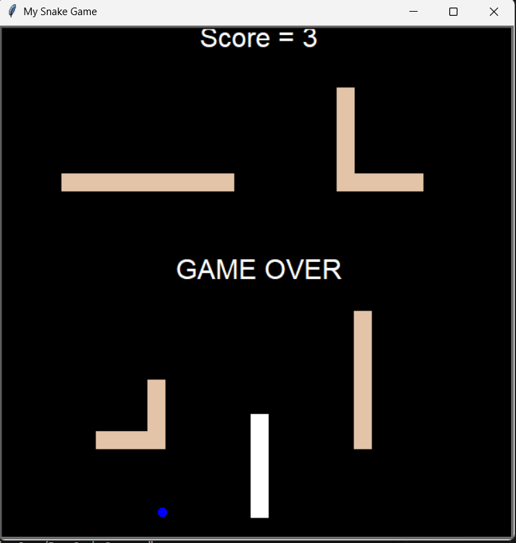

# 🐍 Pro Snake Game

Welcome to **Pro Snake Game** – a modern, feature-rich twist on the classic Snake game!  
Guide your snake, eat food, dodge tricky obstacles, and aim for the highest score.  
Built with Python’s `turtle` graphics, this project is perfect for learning, playing, and expanding your coding skills.

---

## ✨ Features

- **Classic Snake Gameplay**: Easy to play, hard to master!
- **Obstacles**: Navigate around challenging barriers for an extra layer of fun.
- **Scoreboard**: Keep track of your high scores.
- **Colorful Graphics**: Enjoy a vibrant, retro-inspired look.
- **Modular Code**: Clean, well-organized Python files for easy understanding and extension.

---

## 🚀 Getting Started

### Prerequisites

- Python 3.x  
- The `turtle` module (usually included with Python)

### Installation

1. **Clone the repository:**
    ```bash
    git clone https://github.com/yourusername/ProSnakeGame.git
    cd ProSnakeGame
    ```

2. **Run the game:**
    ```bash
    python Pro_SnakeGame.py
    ```

---

## 🎮 How to Play

- **Arrow Keys**: Control the snake’s direction (Up, Down, Left, Right)
- **Eat Food**: Grow longer and increase your score
- **Avoid Obstacles**: Hitting one ends the game!
- **Don’t Hit the Walls or Yourself**: Classic snake rules apply

---

## 🗂️ Project Structure

```
Snake_With_Obstacles/
│
├── Pro_SnakeGame.py   # Main game loop
├── snake.py           # Snake logic
├── food.py            # Food logic
├── obstacle.py        # Obstacles logic
├── interface.png      # Screenshot
└── scoreboard.py      # Scoreboard display
```

---

## 🌟 Screenshots


---

Made with ❤️ using Python
